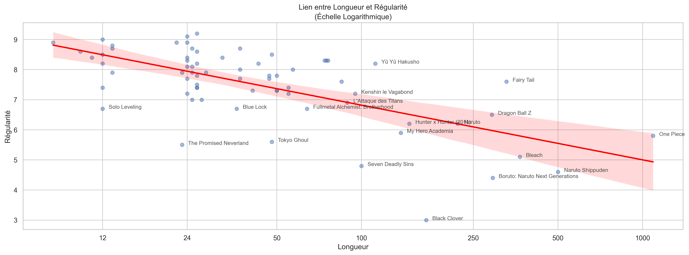
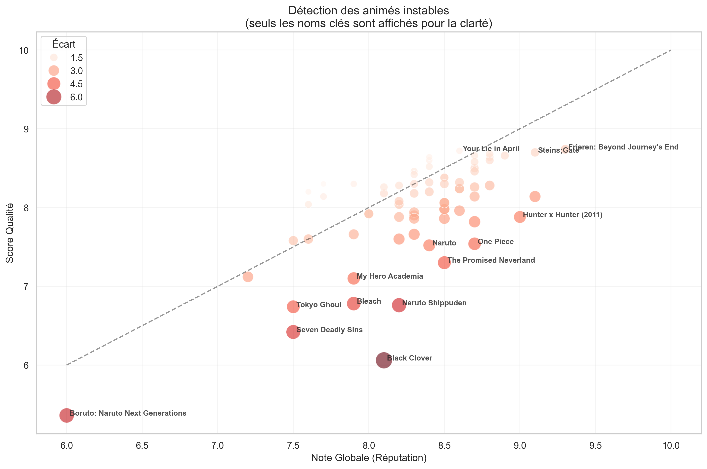
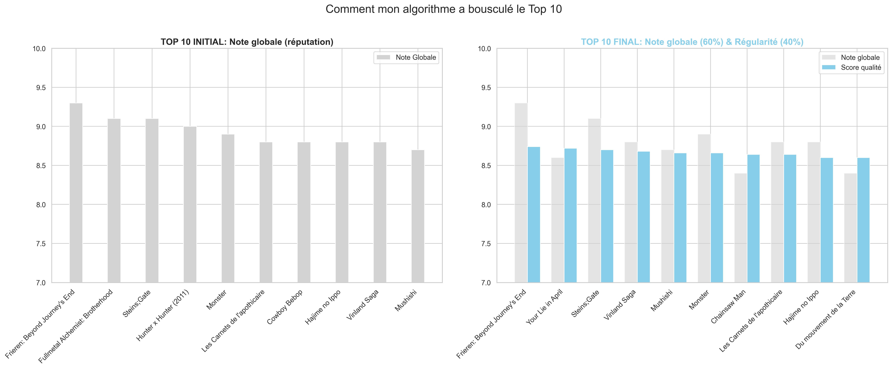
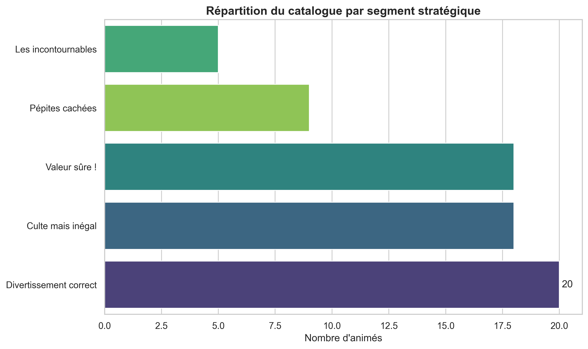

# Score Éditorial Anime

Identifier rapidement des animés "à forte valeur éditoriale" à partir de données limitées pour une plateforme de streaming.


## Problématique: La qualité réelle des animés vs la "hype"

La note globale d'une oeuvre est souvent gonflée par la nostalgie ou la "hype". Les animés très longs conservent des notes élevées (8+/10) malgré des arcs entiers de mauvaise qualité ("fillers", animation bâclée).

Ce projet vise à corriger les biais de notation des plateformes classiques en introduisant une mesure de **stabilité technique**.

L'objectif est de répondre à la question: *"La popularité d'un animé (sa note globale) reflète-t-elle vraiment sa qualité technique constante?"*

## La démarche (méthodologie)

### 1. Nettoyage des données 

Base: Dataset brut de 73 animés, contenant notes, nombre d'épisodes, et métadonnées.

Traitements effectués:

  - Suppression des doublons pour éviter les biais statistiques. 

  - Gestion des valeurs manquantes (NaN) et des formats erronés.

  - Conversion des formats date, extraction du genre principal. 

### 2. Feature Engineering

  - 'Écart' qui consiste à calculer la différence entre la note du meilleur épisode et la note du pire épisode. Plus l'écart est grand et plus l'animé est inconstant.
    
  - 'Régularité', sert à mesure la stabilité de la qualité de l'animé.
    
  - 'Score Qualité', décision d'accorder 60% d'importance à la note globale et 40% d'importance à la régularité. 
    
  - 'Longueur', cette feature nous permet de "tasser" les extrêmes; on ne peut pas comparer un animé de 1000 épisodes à un animé de 12 épisodes sans que le premier n'écrase l'autre lors des calculs. 

### 3. Ma solution: Le "Score Qualité"

**Le coeur de l'analyse.** 

On ne se fie pas seulement à la note globale, la régularité joue un vrai rôle. Pondération de 60/40. 

---

## Résultats & visualisations

### Analyse 1: L'impact de la longueur sur la régularité
J'ai démontré une corrélation négative entre le nombre d'épisodes et la régularité.




### Analyse 2: La détection des animés instables 
Ce graphique démontre comment ma feature 'Score_Qualité' affecte l'ensemble du catalogue, en confrontant la note globale (axe X) à mon score recalculé (axe Y). 



### Analyse 3: L'irruption d'un nouveau Top 10

Top 10 avant (basé uniquement sur la note globale) et Top 10 après (prenant en compte mon Score Qualité)



## Segmentation éditoriale

J'ai classé le catalogue en 5 catégories pour guider les recommandations:

**Les Incontournables**: L'élite absolue. Note Globale ET Régularité très élevées (> 8.5).

**Pépites cachées**: La découverte. Le Score Qualité calculé est supérieur à la Note Globale, révélant une œuvre techniquement sous-estimée par le grand public.

**Culte mais inégal**: Le piège. Une popularité immense (> 8.5) mais une stabilité technique plus faible (< 8.0). Idéal pour l'acquisition (le nom attire), mais risqué pour la rétention (la qualité déçoit).

**Valeur sûre !**: Des œuvres solides (score > 8.0) sans être des chefs-d'œuvre absolus. Le choix du risque zéro.

**Divertissement correct**: Le reste du catalogue. Des œuvres pour passer le temps, sans garantie de qualité exceptionnelle.



## Recommandation éditoriale

  - Mon sytème de recommandation vérifie l'existence de l'œuvre et identifie son genre principal pour garantir une cohérence thématique.
    
  - Il isole tous les animés du même genre, en excluant celui déjà visionné par l'utilisateur.
    
  - Au lieu de trier par popularité brute (note globale), le moteur trie les résultats selon mon Score Qualité (60% Note Globale + 40% Régularité).
    
  - Il retourne ensuite le top 3 des œuvres les plus "sûres" et qualitatives pour maximiser la rétention.

## Structure du Dépôt


```text
├── data/
│   ├── animes.csv       # Dataset brut (avant nettoyage)
│   └── animes_clean_final.csv   # Dataset nettoyé utilisé pour l'analyse
│
├── graphiques/                      # Export des graphiques générés
│
├── score_editorial_anime.ipynb # Le Notebook complet (Code Python)
│
└── requirements.txt             # Environnement technique

```

## Comment lancer le projet?

**1. Cloner le dépôt et entrer dans le dossier:**
```bash
git clone [https://github.com/c-txr/projet-data-anime.git](https://github.com/c-txr/projet-data-anime.git)
cd projet-data-anime
```

**2. Installer les librairies nécessaires:**
```bash
pip install -r requirements.txt
```

**3. Lancer le notebook Jupyter:**
```bash
jupyter notebook
```

---

**Projet réalisé par Chaden TEIXEIRA**, *dans le cadre de ma première année de Bachelor en Développement Web*.

Merci !
